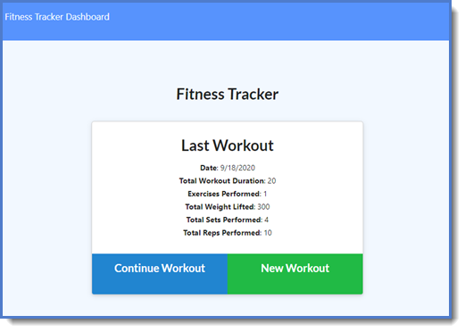
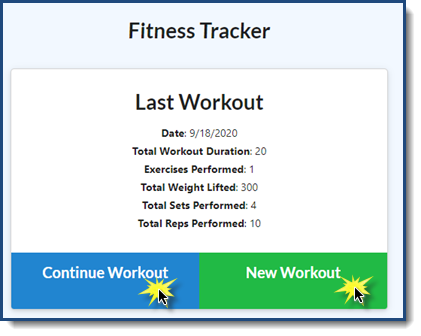
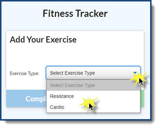
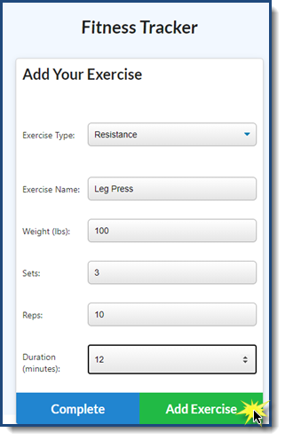
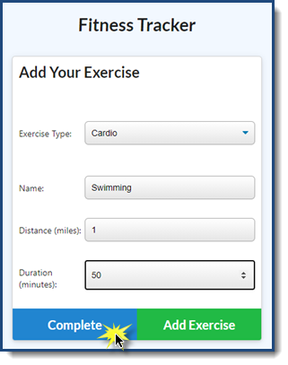
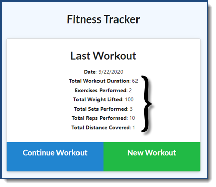
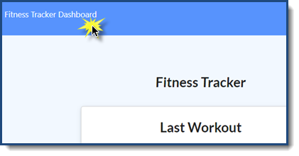
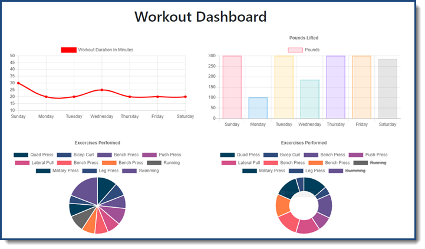
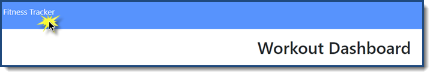
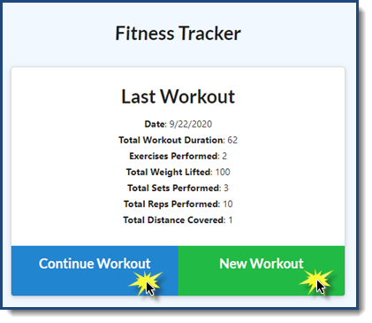

# Workout Tracker

### Unit 17: NoSQL Homework

### User Story

* As a user, I want to be able to view create and track daily workouts. 
* I want to be able to log multiple exercises in a workout on a given day. 
* I should also be able to track the name, type, weight, sets, reps, and duration of exercise. 
* If the exercise is a cardio exercise, I should be able to track my distance traveled.

## Description

Use the workout tracker to enter your daily Resistance and Cardio exercises for a single workout. There is dashboard included as well that shows your progress.

Access the deployed Heroku app here: https://workout-tracker-92233.herokuapp.com/ 

Access the git repo here: https://github.com/cbayley-edu/workout-tracker

## Table of Contents 

* [Installation](#installation)
* [Usage](#usage)
* [License](#license)
* [Questions](#questions)

## Installation 

Since this is a Heroku app, there is no installation required however, if you want to clone or fork my github repo, feel free to do so. You'll have to setup your own MongoDB and add it to your Heroku variables to store your own data.

If you do fork my repo, you'll need to run npm install to install the necessary files to run the app locally as well as having the mongo service running locally.

## Usage

Visit the Heroku app URL to use the application: https://workout-tracker-92233.herokuapp.com/ 

Since there are existing workouts, you'll see the stats from the last workout.

To add an exercise to the existing workout, click 'Continue Workout'. To create a new workout, click 'New Workout'.

Select your exercise type - Resistance or Cardio.

For Resistance, you will have the ability to enter the Name, Weight (in pounds), the number of Sets and Reps, and the Duration (in minutes). To add an additional exercise to the workout, click 'Add Exercise'.

For Cardio, you will have the ability to enter the Name, Distance (in miles), and the Duration (in minutes). To complete your workout, click 'Complete'.

After you complete your workout, you will return to the Fitness Tracker page and again, you will see the stats from your last workout. As you can see, the two exercises are summaried together as one workout.

In addition to the last workout/day summary, you can also view a dashboard of your workouts for the past week. Click on 'Fitness Tracker Dashboard' to view the data visualization.

On the left side of the dashboard you will see a line graph showing the Total Duration in Minutes by day for the past week. Below the line graph you will see a pie chart broken down by the type of exercise. On the right side of the dashboard you will see a bar chart showing the Total Pounds Lifted by day for the past week. Below the bar chart you will see a doughnut graph broken down by the type of resistence exercise (you'll notice that cardio exercises are listed with a line through them since no pounds are entered for cardio).

From the Dashboard, you can return to the Fitness Tracker screen by clicking 'Fitness Tracker' in the upper left corner.

This will take you back to the last workout/day summary screen where you can add an exercise to your current workout or start a new workout.

## License 

This project is covered by the above license(s). Click on the badge for more information.

## Questions 

GitHub username: cbayley-edu
GitHub profile link: https://github.com/cbayley-edu

Please email me at christinabayley@comcast.net with any questions you have or any issues you come across.

